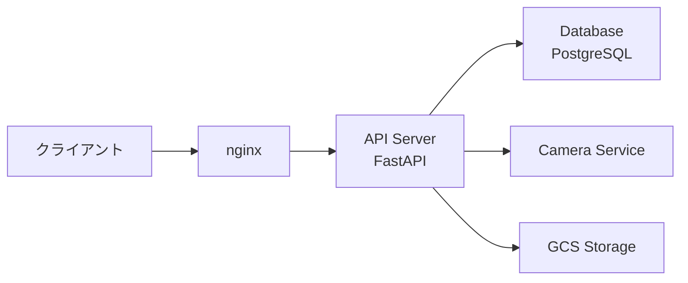

# 🔌 API リファレンス

Coordinate Recorder システムの API エンドポイントと使用方法を説明するドキュメント集です。

## 📋 API ドキュメント一覧

### 📡 エンドポイント仕様

- **[endpoints.md](./endpoints.md)**
  - 実装済 API エンドポイント一覧
  - 写真管理・ワードローブ管理 API
  - 推奨・非推奨エンドポイント情報

### 👕 ワードローブ管理

- **[wardrobe-management.md](./wardrobe-management.md)**
  - ワードローブ機能の詳細仕様
  - 衣類アイテム管理・分類
  - コーディネート記録 API

### 🔧 クライアント実装

- **[apiClient.md](./apiClient.md)**
  - フロントエンド ApiClient 使用ガイド
  - 統一された API 呼び出しパターン
  - モックパターンとテスト方法

## 🎯 API 概要

### システム構成



### 基本アクセス情報

| 環境             | Base URL                     | 認証        |
| ---------------- | ---------------------------- | ----------- |
| **ローカル開発** | `http://localhost:8000`      | なし        |
| **nginx 経由**   | `http://localhost/api`       | なし        |
| **外部アクセス** | `https://api.yourdomain.com` | Google 認証 |

## 🚀 クイックスタート

### 基本的な API 使用例

#### 1. ヘルスチェック

```bash
# API サーバーの状態確認
curl http://localhost:8000/health

# レスポンス例:
# {"status":"healthy","timestamp":"2024-08-28T12:00:00Z"}
```

#### 2. 写真アップロード

```bash
# 写真ファイルのアップロード
curl -X POST http://localhost:8000/api/v2/upload \
  -F "file=@photo.jpg" \
  -F "metadata={\"description\":\"今日のコーデ\"}"
```

#### 3. 記録一覧取得

```bash
# 服装記録の取得
curl http://localhost:8000/api/v2/records?date=2024-08-28

# ワードローブアイテム一覧
curl http://localhost:8000/api/v2/wardrobe/items
```

### 開発環境での API 確認

```bash
# API サーバー起動
./scripts/start-development.sh

# インタラクティブ API ドキュメント（Swagger UI）
open http://localhost:8000/docs

# API 仕様書（ReDoc）
open http://localhost:8000/redoc
```

## 📊 API 使用パターン

### 主要なユースケース

#### 写真管理ワークフロー

1. **写真アップロード** → `/api/v2/upload`
2. **AI 検出処理** → 自動実行（バックグラウンド）
3. **結果取得** → `/api/v2/records`
4. **写真データ取得** → `/api/v2/photos/{photo_id}`

#### ワードローブ管理ワークフロー

1. **アイテム登録** → `/api/v2/wardrobe/items`
2. **分類・タグ付け** → `/api/v2/wardrobe/items/{item_id}`
3. **コーディネート記録** → `/api/v2/wardrobe/outfits`
4. **統計・分析** → `/api/v2/wardrobe/analytics`

## 🔧 認証・セキュリティ

### 認証方式

| アクセス方法 | 認証         | 用途           |
| ------------ | ------------ | -------------- |
| **ローカル** | 不要         | 開発・テスト   |
| **LAN 内**   | 不要         | 家庭内利用     |
| **外部**     | Google OAuth | 外出先アクセス |

### セキュリティ考慮事項

- **HTTPS 必須**: 外部アクセス時
- **ファイルアップロード制限**: 画像ファイルのみ、最大 10MB
- **レート制限**: 1分間に 60 リクエスト
- **データ保護**: 個人の写真データの暗号化

## 📈 パフォーマンス

### 推奨パフォーマンス指標

| 操作                 | 目標レスポンス時間 | 備考                 |
| -------------------- | ------------------ | -------------------- |
| **ヘルスチェック**   | < 100ms            | 常時監視用           |
| **写真アップロード** | < 5秒              | ファイルサイズ依存   |
| **記録取得**         | < 500ms            | ページネーション対応 |
| **AI 検出**          | < 30秒             | バックグラウンド処理 |

### パフォーマンス最適化

```bash
# API サーバーのメモリ最適化（Raspberry Pi）
export UVICORN_WORKERS=2
export UVICORN_MAX_REQUESTS=1000

# キャッシュ設定
export REDIS_URL=redis://localhost:6379  # オプション
```

## 🔍 データ形式

### 共通レスポンス形式

```json
{
  "success": true,
  "data": {...},
  "message": "Operation completed",
  "timestamp": "2024-08-28T12:00:00Z"
}
```

### エラーレスポンス形式

```json
{
  "success": false,
  "error": {
    "code": "VALIDATION_ERROR",
    "message": "Invalid file format",
    "details": {...}
  },
  "timestamp": "2024-08-28T12:00:00Z"
}
```

## 🧪 テスト・デバッグ

### API テストツール

```bash
# curl での基本テスト
./scripts/test/api-smoke-test.sh

# Python での詳細テスト
poetry run pytest tests/api/v2/

# パフォーマンステスト
./scripts/test/api-load-test.sh
```

### デバッグ情報

```bash
# API サーバーログ（VPS の user unit なので --user が要る）
journalctl --user -u coordinate-api -f

# 詳細デバッグモード
export LOG_LEVEL=DEBUG
./scripts/start-development.sh
```

## 🔄 API バージョニング

### バージョン戦略

- **v2**: 現在の安定版（推奨）
- **v1**: レガシー版（非推奨、互換性維持）
- **wardrobe**: 専用機能 API

### 移行ガイド

```bash
# v1 → v2 の主な変更点
# /upload → /api/v2/upload
# /records → /api/v2/records
# レスポンス形式の統一化
```

## 📚 外部連携

### 連携可能なサービス

- **Google Cloud Storage**: 写真データ保存
- **Webhook**: 外部システムへの通知
- **WebSocket**: リアルタイム更新

### 連携設定例

```bash
# GCS 連携
export GCS_BUCKET_NAME=your-photos-bucket
export GOOGLE_APPLICATION_CREDENTIALS=/path/to/credentials.json

# Webhook 設定
export WEBHOOK_URL=https://your-service.com/webhook
```

## 🔗 関連ドキュメント

- [システムセットアップ](../setup/) - API サーバー構築
- 運用監視 - API パフォーマンス監視
- [開発者向け](../development/) - ローカル品質チェック等

## 🆘 サポート

API 利用時の問題:

1. **一般的な問題** → [endpoints.md](./endpoints.md) のトラブルシューティング
2. **認証関連** → [access-setup.md](../setup/access-setup.md)
3. **パフォーマンス** → monitoring.md
4. **バグ報告** → GitHub Issue で報告
