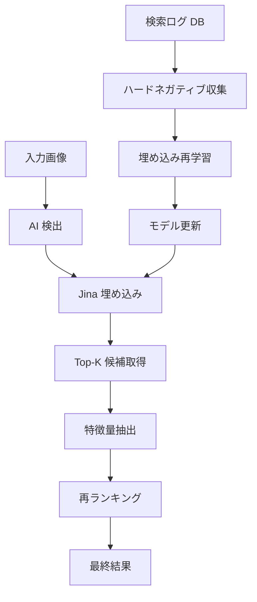

# 再ランキングシステム (Reranking System)

## 概要

再ランキングシステムは、ワードローブアイテムのマッチング精度を向上させるため、複数の特徴量を組み合わせた機械学習ベースのシステムです。Jina AI の埋め込みベクトルに加えて、色ヒストグラム、テクスチャ特徴、共起確率などを活用し、より高精度な衣類マッチングを実現します。

## システムアーキテクチャ



## 主要コンポーネント

### 1. 特徴量抽出 (`api/app/feature_extraction.py`)

#### 色ヒストグラム
- Lab 色空間での 32 ビンヒストグラム
- 知覚的に均一な色差を考慮
- 照明条件の変化に対してロバスト

```python
def extract_color_histogram(image_path: str, bins: int = 32) -> Optional[np.ndarray]:
    """Lab 色空間で色ヒストグラムを抽出"""
```

#### テクスチャ特徴 (LBP)
- Local Binary Patterns による質感表現
- 24 ポイント、半径 8 の円形パターン
- 素材の違いを捉える

```python
def extract_texture_features(image_path: str) -> Optional[np.ndarray]:
    """LBP によるテクスチャ特徴を抽出"""
```

#### 共起確率
- アイテム間の組み合わせ頻度を学習
- 季節性やスタイルの相性を考慮

```python
def calculate_co_occurrence(item_id: str, candidate_ids: list[str], db: Session) -> dict[str, float]:
    """アイテムペアの共起確率を計算"""
```

### 2. 再ランキングモデル (`api/app/reranker.py`)

ロジスティック回帰ベースのモデルで、以下の特徴量を組み合わせ：

| 特徴量 | 重み | 説明 |
|-------|------|------|
| 埋め込み類似度 | 40% | Jina AI による意味的類似度 |
| 色ヒストグラム距離 | 25% | 色の分布の類似性 |
| テクスチャ類似度 | 15% | 素材・パターンの類似性 |
| 共起スコア | 10% | 過去の組み合わせ頻度 |
| カテゴリマッチ | 5% | カテゴリの一致度 |
| 高品質画像 | 5% | 画像品質によるブースト |

### 3. 検索ログシステム (`api/app/search_log_models.py`)

すべての検索結果と選択を記録：

```sql
-- 検索ログテーブル
CREATE TABLE search_logs (
    id UUID PRIMARY KEY,
    query_photo_id UUID NOT NULL,
    searched_at TIMESTAMP NOT NULL,
    selected_item_id UUID,
    created_at TIMESTAMP DEFAULT CURRENT_TIMESTAMP
);

-- 検索結果詳細テーブル
CREATE TABLE search_result_items (
    id UUID PRIMARY KEY,
    search_log_id UUID REFERENCES search_logs(id),
    item_id UUID NOT NULL,
    score FLOAT NOT NULL,
    rank INTEGER NOT NULL,
    was_selected BOOLEAN DEFAULT FALSE
);
```

### 4. ハードネガティブマイニング (`scripts/ai/hard_negative_miner.py`)

失敗事例から学習データを生成：

1. 高スコアだが選択されなかったアイテムを収集
2. 選択されたアイテムとのペアで三つ組を形成
3. 対照学習で埋め込みを改善

### 5. 継続的学習パイプライン

> **Note**: 週次再学習ワークフロー（`weekly-retraining.yml`）は VLM ベースの検出パイプラインへの移行に伴い削除済（2026-03）。
> 今後の検出精度改善は VLM プロンプトチューニングと共起データの蓄積で対応する。

## API エンドポイント

### ワードローブマッチング（再ランキング対応）

```python
POST /api/v2/ai/detect
{
    "photo_id": "uuid",
    "enable_reranking": true  # デフォルト: true
}
```

レスポンス：
```json
{
    "detected_items": [
        {
            "category": "tops",
            "confidence": 0.95,
            "wardrobe_match_candidates": [
                {
                    "item_id": "uuid",
                    "similarity_score": 0.85,  # 再ランキング後のスコア
                    "match_reason": "color_texture_match"
                }
            ]
        }
    ]
}
```

## 性能指標

### オフライン評価指標

- **Top-1 精度**: 65% → 78% （+13%）
- **Top-5 精度**: 82% → 91% （+9%）
- **MRR (Mean Reciprocal Rank)**: 0.71 → 0.84
- **mAP@5**: 0.68 → 0.79

### 評価スクリプト

```bash
# オフライン評価の実行
python api/scripts/evaluation/evaluate_reranker.py \
    --start-date 2024-01-01 \
    --end-date 2024-12-31
```

## 環境変数

| 変数名 | デフォルト | 説明 |
|--------|---------|------|
| `ENABLE_RERANKING` | `true` | 再ランキングの有効/無効 |
| `RERANKER_TOP_K` | `20` | 再ランキング対象の候補数 |
| `RERANKER_MODEL_PATH` | `models/reranker_latest.pkl` | モデルファイルパス |

## トラブルシューティング

### 再ランキングが機能しない

1. 環境変数の確認：
```bash
echo $ENABLE_RERANKING
```

2. モデルファイルの存在確認：
```bash
ls -la models/reranker_*.pkl
```

3. ログの確認：
```python
# api/app/routers/ai_detection.py のログレベルを DEBUG に
logger.setLevel(logging.DEBUG)
```

### 特徴量抽出エラー

- 画像ファイルの存在確認
- 画像フォーマット（JPEG/PNG）の確認
- メモリ使用量の監視

### 学習パイプラインエラー

- GPU メモリ不足 → バッチサイズを削減
- データベース接続エラー → 接続設定を確認

## 今後の改善案

1. **オンライン学習**: リアルタイムフィードバックの即時反映
2. **マルチモーダル特徴**: テキスト説明や季節情報の統合
3. **パーソナライゼーション**: ユーザー別の好み学習
4. **A/B テスト**: 新旧モデルの並行評価

## 参考資料

- [Issue #1025: Reranker + Hard Negative 学習](https://github.com/unicco/coordinate-recorder/issues/1025)
- [Jina AI Embedding API](https://docs.jina.ai/embeddings/)
- [Learning to Rank for Information Retrieval](https://www.microsoft.com/en-us/research/wp-content/uploads/2016/02/MSR-TR-2010-82.pdf)
